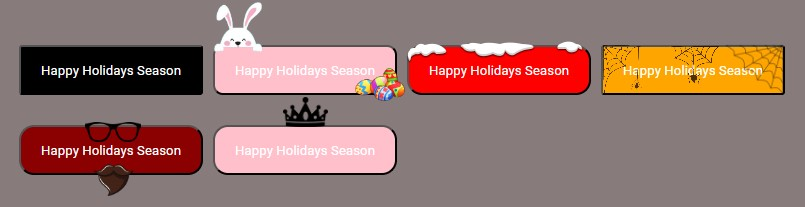

# holidaybuttons

> A simple and customizable holiday buttons package for your web applications.

[](https://www.npmjs.com/package/holidaybuttons) [](https://standardjs.com)

## Install

[NPMJS](https://www.npmjs.com/package/holidaybuttons)

```bash
npm install --save holidaybuttons
```

## Example



## Types

There are `default` button, `easter` button, `christmas` button, `halloween` button, `fatherDay` button, `motherDay` button in holidaybuttons.

## Usage

```jsx
import { HolidayButtons } from 'holidaybuttons'
import 'holidaybuttons/dist/index.css'

const App = () => {
  return (
    <div>
      <HolidayButtons type=''>Happy Holidays Season</HolidayButtons>
      <HolidayButtons type='easter'>Happy Holidays Season</HolidayButtons>
      <HolidayButtons type='christmas'>Happy Holidays Season</HolidayButtons>
      <HolidayButtons type='halloween'>Happy Holidays Season</HolidayButtons>
      <HolidayButtons type='fatherDay'>Happy Holidays Season</HolidayButtons>
      <HolidayButtons type='motherDay'>Happy Holidays Season</HolidayButtons>
    </div>
  )
}
```

## License

MIT © [anilaltan](https://github.com/anilaltan)
